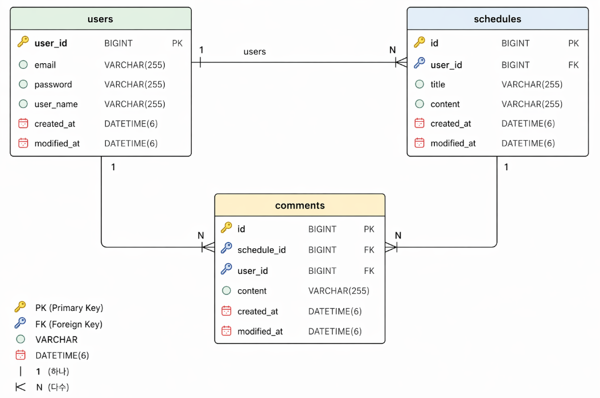

# 📅 Schedule Develop

Spring Boot 기반 일정 관리 API 서버입니다.  
사용자는 회원가입 및 로그인 후 자신의 일정과 댓글을 관리할 수 있습니다.

---
## 📊 ERD

---
## 🔄 API 명세서

👉 자세한 API 명세: https://velog.io/@kimsy628/Schedule-Develop-API-%EB%AA%85%EC%84%B8%EC%84%9C

👉 Postman Collection: https://documenter.getpostman.com/view/53036105/2sBXqFMND8

---
## 🛠 기술 스택

- Language: Java 17
- Framework: Spring Boot
- ORM: Spring Data JPA
- Database: MySQL
- 인증: Session 기반 인증
- Validation: Bean Validation
- 기타:
    - Pagination
    - Global Exception Handling
    - DTO 패턴

---

## 🧱 아키텍처

- 3 Layer Architecture
    - Controller
    - Service
    - Repository

---

## 📂 도메인 구성

- 📅 Schedule (일정)
- 💬 Comment (댓글)
- 👤 User (사용자)
- 🔐 Auth (인증)

---

# 📅 Schedule

## 개요
로그인한 사용자가 생성하는 핵심 도메인입니다.

| Method | URL | 설명 |
|------|-----|-----|
| POST | /schedules | 일정 생성 (로그인 필요) |
| GET | /schedules/{id} | 일정 단건 조회 |
| GET | /schedules/page | 일정 목록 조회 (페이지네이션) |
| PATCH | /schedules/{id} | 일정 수정 (본인만 가능) |
| DELETE | /schedules/{id} | 일정 삭제 (본인만 가능) |

## 주요 기능
- 일정 생성
- 단건 조회
- 수정 / 삭제 (본인만 가능)
- 페이지 조회
- 댓글 수 포함 조회

## 핵심 설계

### 1. 인증 처리
- userId를 요청에서 받지 않음
- 세션 사용자 기반 생성

### 2. 권한 검증
- 작성자 본인만 수정/삭제 가능

### 3. 페이지네이션
- `Pageable` 사용
- DTO Projection 적용
- 댓글 수 포함 조회

### 4. 삭제 처리 (중요)
- 댓글 먼저 삭제 → 일정 삭제
- FK 오류 방지

---

# 💬 Comment

## 개요
일정에 대한 댓글을 관리하는 도메인입니다.

| Method | URL | 설명 |
|------|-----|-----|
| POST | /comments | 댓글 생성 (로그인 필요) |
| GET | /comments/schedules/{scheduleId} | 일정별 댓글 조회 |

## 주요 기능
- 댓글 생성 (로그인 필요)
- 일정별 댓글 조회

## 핵심 설계
- User + Schedule 연관관계
- 세션 기반 사용자 처리
- DTO 내부 `from()` 메서드 활용
---

# 👤 User

## 개요
사용자 관리 도메인으로, 인증 및 데이터 소유권의 기준이 됩니다.

| Method | URL | 설명 |
|------|-----|-----|
| POST | /users | 회원가입 |
| GET | /users | 사용자 목록 조회 |
| GET | /users/{userId} | 사용자 단건 조회 |
| PATCH | /users | 사용자 수정 (로그인 필요) |
| DELETE | /users/{userId} | 사용자 삭제 (본인만 가능) |

## 주요 기능
- 회원가입 (비밀번호 암호화)
- 단건 조회 / 전체 조회
- 수정 (로그인 필요)
- 삭제 (본인만 가능)
- 이메일 중복 검증

## 핵심 설계
- 이메일 unique 제약
- `existsByEmail()`로 중복 검증
- `stream + from()`으로 DTO 변환

---

# 🔐 Auth

## 개요
세션 기반 인증을 담당하는 도메인입니다.

| Method | URL | 설명 |
|------|-----|-----|
| POST | /auth/login | 로그인 |
| POST | /auth/logout | 로그아웃 |

## 주요 기능
- 로그인
- 로그아웃
- 세션 사용자 관리

## 인증 방식
- HttpSession 사용
- 로그인 시 SessionUser 저장
- 로그아웃 시 invalidate

---
